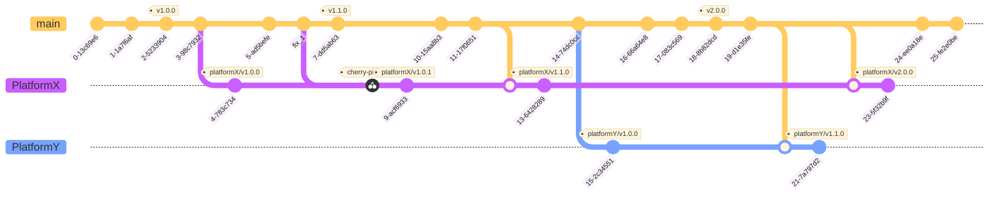

# DBaaS Platform OLM Catalog

<!-- toc -->
- [DBaaS Platform OLM Catalog](#dbaas-platform-olm-catalog)
  - [Summary](#summary)
  - [Motivation](#motivation)
    - [Goals](#goals)
    - [Non-Goals](#non-goals)
  - [Proposal](#proposal)
    - [User Stories (Optional)](#user-stories-optional)
      - [Story 1](#story-1)
      - [Story 2](#story-2)
      - [Story 3](#story-3)
      - [Story 4](#story-4)
      - [Story 5](#story-5)
      - [Story 6](#story-6)
    - [Notes/Constraints/Caveats (Optional)](#notesconstraintscaveats-optional)
    - [Risks and Mitigations](#risks-and-mitigations)
  - [Design Details](#design-details)
    - [Add or Update operator catalog](#add-or-update-operator-catalog)
    - [Catalog tree](#catalog-tree)
    - [Create a new platform](#create-a-new-platform)
    - [Git branching](#git-branching)
    - [Catalog images](#catalog-images)
    - [Candidate Channel](#candidate-channel)
    - [Use Catalog](#use-catalog)
    - [Test Plan](#test-plan)
        - [Unit tests](#unit-tests)
        - [Integration tests](#integration-tests)
        - [e2e tests](#e2e-tests)
    - [Upgrade / Downgrade Strategy](#upgrade--downgrade-strategy)
    - [Version Skew Strategy](#version-skew-strategy)
  - [Implementation History](#implementation-history)
  - [Drawbacks](#drawbacks)
  - [Alternatives](#alternatives)
  - [Infrastructure Needed (Optional)](#infrastructure-needed-optional)
<!-- /toc -->

## Summary

<!--
This section is incredibly important for producing high-quality, user-focused
documentation such as release notes or a development roadmap. It should be
possible to collect this information before implementation begins, in order to
avoid requiring implementors to split their attention between writing release
notes and implementing the feature itself. KEP editors and SIG Docs
should help to ensure that the tone and content of the `Summary` section is
useful for a wide audience.

A good summary is probably at least a paragraph in length.

Both in this section and below, follow the guidelines of the [documentation
style guide]. In particular, wrap lines to a reasonable length, to make it
easier for reviewers to cite specific portions, and to minimize diff churn on
updates.

[documentation style guide]: https://github.com/kubernetes/community/blob/master/contributors/guide/style-guide.md
-->

DBaaS Platform OLM Catalog would provide set of operators to extend Kubernetes to deliver DBaaS Platform based on it.

## Motivation

<!--
This section is for explicitly listing the motivation, goals, and non-goals of
this KEP.  Describe why the change is important and the benefits to users. The
motivation section can optionally provide links to [experience reports] to
demonstrate the interest in a KEP within the wider Kubernetes community.

[experience reports]: https://github.com/golang/go/wiki/ExperienceReports
-->

### Goals

<!--
List the specific goals of the KEP. What is it trying to achieve? How will we
know that this has succeeded?
-->

Create and Maintain OLM DBaaS Platform Catalog to provide instrumentation (catalog of operators) to build DBaaS Platform on Kubernetes base. Enable community to develop and extend this catalog.

### Non-Goals

<!--
What is out of scope for this KEP? Listing non-goals helps to focus discussion
and make progress.
-->

Developing operators, creating/developing/maintaining operator bundles.

Creating/Developing DBaaS Platform.

## Proposal

<!--
This is where we get down to the specifics of what the proposal actually is.
This should have enough detail that reviewers can understand exactly what
you're proposing, but should not include things like API designs or
implementation. What is the desired outcome and how do we measure success?.
The "Design Details" section below is for the real
nitty-gritty.
-->

Proposal is to create a new catalog of operators that solves one particular problem: DBaaS Platform. The scope of that catalog would be everything related to ability to build DBaaS Platform which includes but not limits to such [categories](https://github.com/k8s-operatorhub/community-operators/blob/main/categories.json):
  - Cloud Provider
  - Database
  - Logging & Tracing
  - Monitoring

Such catalog will allow to separate different concerns, to have smaller repos/images/systems, to harden security by reducing the scope.

### User Stories (Optional)

<!--
Detail the things that people will be able to do if this KEP is implemented.
Include as much detail as possible so that people can understand the "how" of
the system. The goal here is to make this feel real for users without getting
bogged down.
-->

#### Story 1

As a SRE I would like to add one catalog and be able to deploy my variant of DBaaS Platform from it.

For example:
  - install DB Server operator
  - install monitoring operator
  - install Database operators that help to manage and operate Databases

#### Story 2

As a SRE I should be able to install any operator from the catalog and subscribe to updates to be able to have updated versions of operators in my kubernetes cluster.

#### Story 3

As a SRE I should be able to switch between catalog channels to try the newest versions of database operators to test my upgrade plans to understand the consequences of upgrading and possible downtime on the production environment.

#### Story 4

As a DBaaS Platform developer I would like to have single catalog to test interoperability of different operators, their custom resources. Thus to be able to release tested and validated catalog of operators to build DBaaS platform.

#### Story 5

As a DBaaS platform developer, I should be able to install the newest version of a database operator and run automated tests against it to improve the overall quality of the operator's interoperability

#### Story 6

As a DBaaS QA, I should be able to install any version of a database operator or a set of database operators in order to test the update/upgrade scenarios and the operator's interoperability.

### Notes/Constraints/Caveats (Optional)

<!--
What are the caveats to the proposal?
What are some important details that didn't come across above?
Go in to as much detail as necessary here.
This might be a good place to talk about core concepts and how they relate.
-->

TBD

### Risks and Mitigations

<!--
What are the risks of this proposal, and how do we mitigate? Think broadly.
For example, consider both security and how this will impact the larger
Kubernetes ecosystem.

How will security be reviewed, and by whom?

How will UX be reviewed, and by whom?

Consider including folks who also work outside the SIG or subproject.
-->

TBD

## Design Details

<!--
This section should contain enough information that the specifics of your
change are understandable. This may include API specs (though not always
required) or even code snippets. If there's any ambiguity about HOW your
proposal will be implemented, this is the place to discuss them.
-->

[OLM Catalogs](https://olm.operatorframework.io/docs/concepts/crds/catalogsource/) is the way to distribute set of operator that can be installed onto a cluster via OLM.

This Catalog will be based on  [Veneers](https://olm.operatorframework.io/docs/reference/veneers/), specifically on `semver veneer` as an approach to simplifying interacting with FBCs (File-Based Catalogs).

Please see [Semver Veneer specification](https://olm.operatorframework.io/docs/reference/veneers/#semver-veneer).

Catalog should have number of different testing layers to test:
  - sanity of individual operator veneer/catalog
  - integration test of new catalog with updated operator
  - interoperability of the new operator version with other operators that could be affected
  - e2e test for the platform configurations

This repo provides only Catalog, OLM [operator bundles](https://olm.operatorframework.io/docs/tasks/creating-operator-bundle/) and their images are provided and maintained by individual operators.

There could be number of bundle sources for this DBaaS Platform Catalog. Operator owners could:
  1. create their own bundles and images and push them to the operator's registry
  2. push operator's manifest and metadata to the [Kubernetes Community operators](https://github.com/k8s-operatorhub/community-operators) repo
  3. use hybrid approach, when RC and testing bundles are created in operator's registry and release one both in operator's and community one

When in a first case Operator owners are responsible to create CI/CD pipelines to build and publish bundle images, in a second case Kubernetes Community does that.


### Add or Update operator catalog

To add new operator - create `veneer.yaml`:

```sh
mkdir catalog/percona-xtradb-cluster-operator ; cd catalog/percona-xtradb-cluster-operator
cat << EOF >> veneer.yaml
Schema: olm.semver
GenerateMajorChannels: true
GenerateMinorChannels: false
Stable:
  Bundles:
  - Image: quay.io/operatorhubio/percona-xtradb-cluster-operator:v1.10.0
EOF
```

To update operator - add new bundle to the existing `veneer`:

```yaml
Schema: olm.semver
GenerateMajorChannels: true
GenerateMinorChannels: false
Stable:
  Bundles:
  - Image: quay.io/operatorhubio/percona-xtradb-cluster-operator:v1.10.0
  - Image: docker.io/percona/percona-xtradb-cluster-operator:v1.11.0-bundle
```
example-operator
Use channel names Candidate, Fast, and Stable as stated in [Veneer specification](https://olm.operatorframework.io/docs/reference/veneers/#specification).

Generate operator catalog:

```
opm alpha render-veneer semver -o yaml < veneer.yaml > catalog.yaml
opm validate .
```

Create PR and get it merged (`veener.yaml` and `catalog.yaml`).


GH CI/CD pipeline would create new image and push it to the registry:

```
podman build . -f dbaas-catalog.Dockerfile -t ghcr.io/percona/dbaas-catalog:main
podman push ghcr.io/percona/dbaas-catalog:main
```

Questions:
  - could it be links to the veneers in other GH repos instead (submodules)?

### Catalog tree

```tree
catalog
├── .indexignore          (to make `opm validate` ignore README.md)
├── README.md
├── OperatorA
│   ├── .indexignore      (to make `opm validate` ignore OWNERS)
│   ├── OWNERS            (owners of the operator catalog to review PRs)
│   ├── veneer.yaml       (Veneer to build catalog.yaml)
│   └── catalog.yaml
└── OperatorB
    ├── .indexignore
    ├── OWNERS
    ├── veneer.yaml
    └── catalog.yaml
```

Required files are:
  - `veneer.yaml`
  - `catalog.yaml`


Other files are optional, and individual catalog might also include some helpers, test and other `yaml` files.

### Create a new platform

Platform is a variant of a community (`main` branch) catalog that might have additional quality gates and/or different set or versions of operators.

Platforms could be created in 2 ways:
  - adding new platforms tests and releases into main repo
  - forking a repo and maintaining same workflow but with additional tests and releases

In the main repo there probably would be a limited number of reference platforms (in a stable branches) as the test matrix and test resources needed could be quite big.

### Git branching

All development happens in the `main` branch and Platform branches (or forks) are created for more advance testing and additional stability.

Platform branches (or forks) could also have less operators included, or include some custom ones that for some reason can't be landed into the `main`. 

Platform branches should merge with `main` as often as possible and new tags trigger rebuild of `latest` platform catalog image.



### Catalog images

  - new image for every commit in `main` branch `github.com/percona/catalog:main`
  - new image after `main` passes all the tests `github.com/percona/catalog:latest`
  - new image for platform branches with every commit `github.com/percona/platformx:main`
  - new image for every tag on platform branch `github.com/percona/platformx:latest` and `github.com/percona/platformx:vX.Y.Z`

### Candidate Channel

`Candiate` channel could be used for CI to test on going operator development and integration with other components:
  - operator candidates with other released operators
  - operators candidates with other operator candidates

Failing CI pipelines in this case could be indicators but still could land into the catalog if basic tests are passing:
  - sanity tests
  - image tests

### Use Catalog

To use latest upstream community DBaaS Platform Catalog:
```sh
kubectl apply -f https://raw.githubusercontent.com/percona/dbaas-catalog/main/dbaas-catalog.yaml
kubectl get catalogsource -n olm
kubectl get packagemanifest -n olm
```

Use needed image and tag in a standard catalog source:
```yaml
apiVersion: operators.coreos.com/v1alpha1
kind: CatalogSource
metadata:
  name: dbaas-catalog
  namespace: olm
spec:
  sourceType: grpc
  image: repo_url/catalog:latest
```

See [Catalog images](#catalog-images) section for images and tags.

### Test Plan

<!--
**Note:** *Not required until targeted at a release.*
The goal is to ensure that we don't accept enhancements with inadequate testing.

All code is expected to have adequate tests (eventually with coverage
expectations). Please adhere to the [Kubernetes testing guidelines][testing-guidelines]
when drafting this test plan.

[testing-guidelines]: https://git.k8s.io/community/contributors/devel/sig-testing/testing.md
-->

[ ] I/we understand the owners of the involved components may require updates to
existing tests to make this code solid enough prior to committing the changes necessary
to implement this enhancement.


##### Unit tests

<!--
In principle every added code should have complete unit test coverage, so providing
the exact set of tests will not bring additional value.
However, if complete unit test coverage is not possible, explain the reason of it
together with explanation why this is acceptable.
-->

<!--
Additionally, for Alpha try to enumerate the core package you will be touching
to implement this enhancement and provide the current unit coverage for those
in the form of:
- <package>: <date> - <current test coverage>
The data can be easily read from:
https://testgrid.k8s.io/sig-testing-canaries#ci-kubernetes-coverage-unit

This can inform certain test coverage improvements that we want to do before
extending the production code to implement this enhancement.
-->

- `<package>`: `<date>` - `<test coverage>`

##### Integration tests

<!--
This question should be filled when targeting a release.
For Alpha, describe what tests will be added to ensure proper quality of the enhancement.

For Beta and GA, add links to added tests together with links to k8s-triage for those tests:
https://storage.googleapis.com/k8s-triage/index.html
-->

- <test>: <link to test coverage>

##### e2e tests

<!--
This question should be filled when targeting a release.
For Alpha, describe what tests will be added to ensure proper quality of the enhancement.

For Beta and GA, add links to added tests together with links to k8s-triage for those tests:
https://storage.googleapis.com/k8s-triage/index.html

We expect no non-infra related flakes in the last month as a GA graduation criteria.
-->

- <test>: <link to test coverage>

### Upgrade / Downgrade Strategy

<!--
If applicable, how will the component be upgraded and downgraded? Make sure
this is in the test plan.

Consider the following in developing an upgrade/downgrade strategy for this
enhancement:
- What changes (in invocations, configurations, API use, etc.) is an existing
  cluster required to make on upgrade, in order to maintain previous behavior?
- What changes (in invocations, configurations, API use, etc.) is an existing
  cluster required to make on upgrade, in order to make use of the enhancement?
-->

### Version Skew Strategy

<!--
If applicable, how will the component handle version skew with other
components? What are the guarantees? Make sure this is in the test plan.

Consider the following in developing a version skew strategy for this
enhancement:
- Does this enhancement involve coordinating behavior in the control plane and
  in the kubelet? How does an n-2 kubelet without this feature available behave
  when this feature is used?
- Will any other components on the node change? For example, changes to CSI,
  CRI or CNI may require updating that component before the kubelet.
-->
## Implementation History

<!--
Major milestones in the lifecycle of a KEP should be tracked in this section.
Major milestones might include:
- the `Summary` and `Motivation` sections being merged, signaling SIG acceptance
- the `Proposal` section being merged, signaling agreement on a proposed design
- the date implementation started
- the first Kubernetes release where an initial version of the KEP was available
- the version of Kubernetes where the KEP graduated to general availability
- when the KEP was retired or superseded
-->

## Drawbacks

<!--
Why should this KEP _not_ be implemented?
-->

## Alternatives

<!--
What other approaches did you consider, and why did you rule them out? These do
not need to be as detailed as the proposal, but should include enough
information to express the idea and why it was not acceptable.
-->

## Infrastructure Needed (Optional)

<!--
Use this section if you need things from the project/SIG. Examples include a
new subproject, repos requested, or GitHub details. Listing these here allows a
SIG to get the process for these resources started right away.
-->
